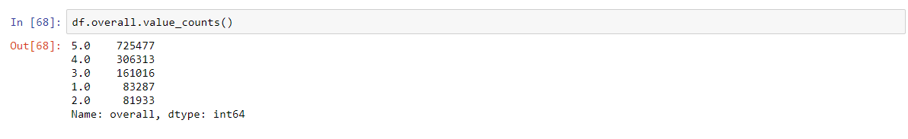

# Colleborative Filtering for Movie Rating predictions

## Description:

This project was posted on Kaggle: https://www.kaggle.com/c/si671-hw1/leaderboard 

My submission was ranked the 1st among 73 classmates

Final submission is an ensembled result of 3 models:
* SVD(param = {'n_factors': 20, 'n_epochs': 30, 'lr_all': 0.01, 'reg_all': 0.15, 'verbose': True})
* SVD(param = {'n_factors': 200, 'n_epochs': 30, 'lr_all': 0.01, 'reg_all': 0.15, 'verbose': True})
* SVD++(param = {'n_factors': 10, 'n_epochs': 20, 'lr_all': 0.009, 'reg_all': 0.15, 'verbose': True})

## Data:
**Training set**: around 1,600,000 records

**Development set**: around 160,000 records

**Testing set**: around 160,000 records

**Rating distribution in train**:

## Analysis:
n_factors is a key parameter in both SVD and SVD++ and it could be understood as the ‘Concept’ we talked about in class. So I suspect that high value of n_factors indicates a detailed classification of the movies while low value of n_factors indicates a general classification. This means that the behavior of these different models would behave differently, and each would capture some of the information. And that is the main reason that I ensembled my models.
Surprise has made these algorithms very straight-forward to use, and I spend most of my effort on stacking and ensembling. I also did a lot of research on Netflix Prize Implementation and learned a lot from their blending tricks. For instance, Feature-Weighted Linear Stacking was an interesting ensembling method proposed by Joe Sill, and has been proved to be useful in many Kaggle tasks. Though I failed to implement it in my submission, I will do more research on it in the future.
SVD takes a relatively short time to train (6 minutes for the whole training set, with n_factors=200) and SVD++ takes 10 times the time, so I didn’t train more models on SVD++.

## Submission Score:

